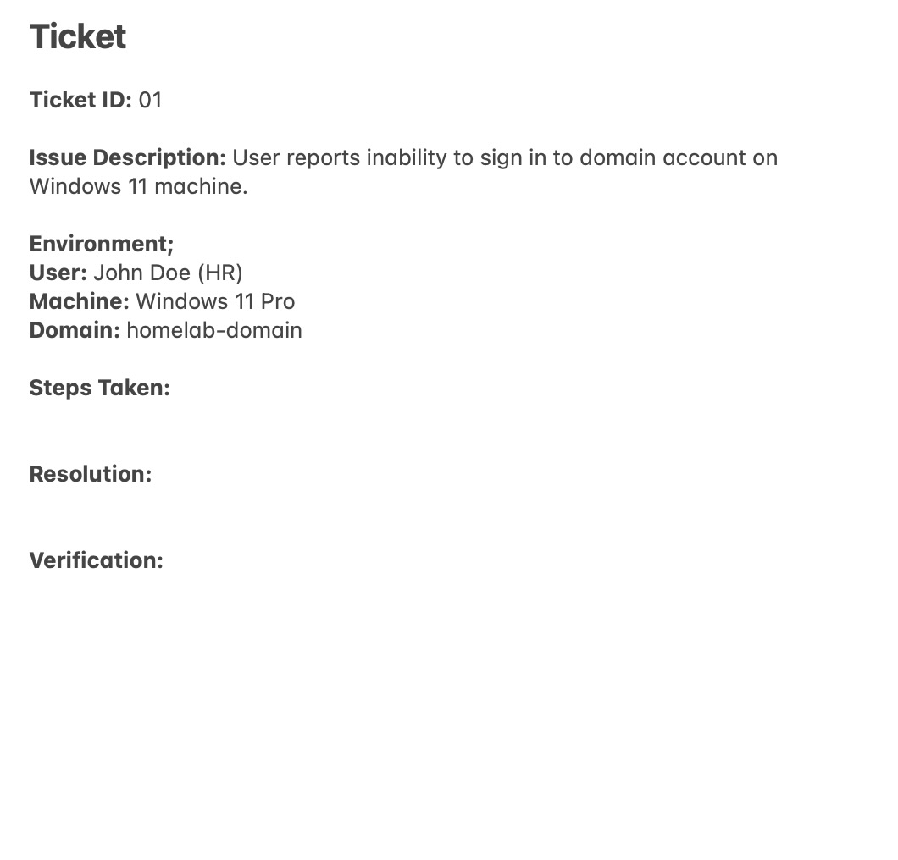
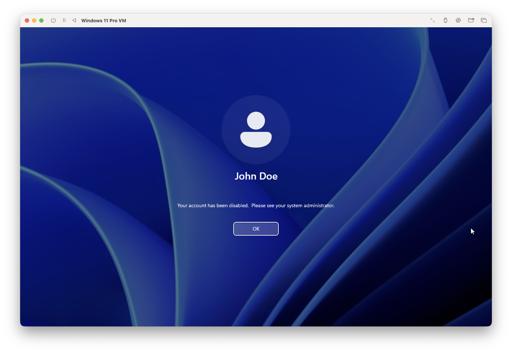
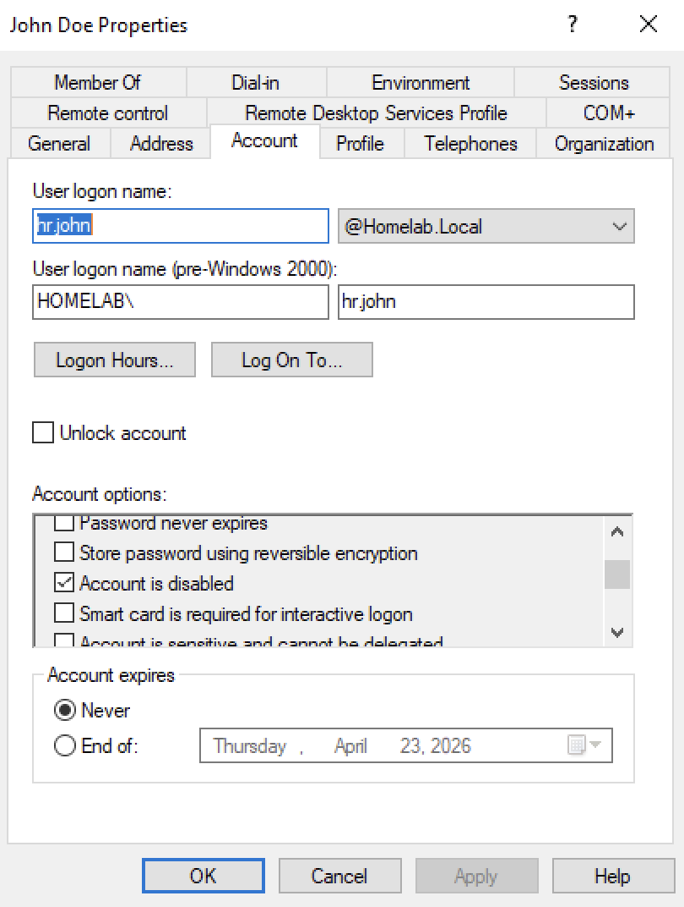
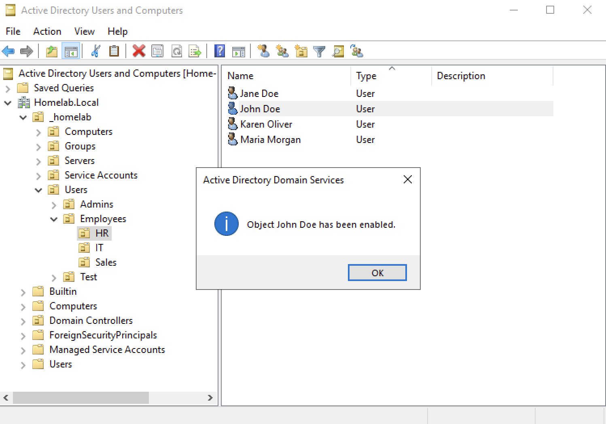
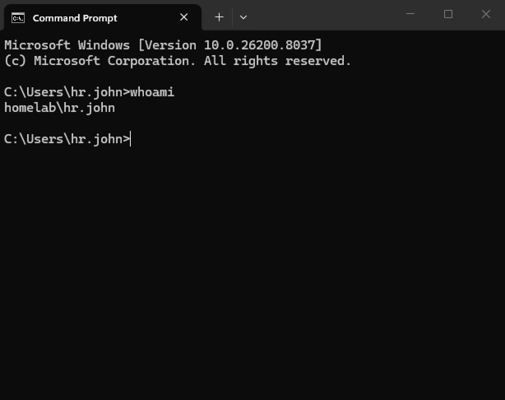
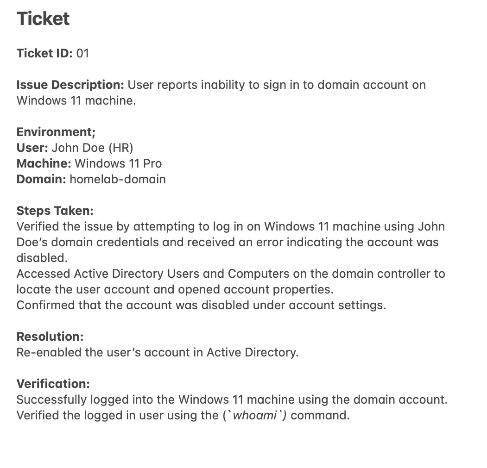

# Active Directory Login Troubleshooting Lab

## Objective
Simulate and troubleshoot a real-world IT support ticket where a domain user is unable to sign in to a Windows 11 machine. Identify the root cause using Active Directory and restore user access.

---

## Lab Environment
- Windows Server 2019 Virtual Machine
- Windows 11 Pro Virtual Machine  
- Active Directory Domain Services (AD DS)  
- Active Directory Users and Computers (ADUC

---

### Ticket
User reports inability to sign in to domain account on Windows 11 machine. Ticket has been received.

 

---

## Steps

### 1. Identified the Problem 
Attempted to log in to the Windows 11 machine using the user’s domain credentials and received an error indicating the account was disabled.



---

### 2. Established a Theory of Probable Cause
Reviewed the error message and formed a hypothesis that the account may be disabled in Active Directory.

---

### 3. Tested The Theory
Opened Active Directory Users and Computers on the domain controller and located the user account. Opened the user account properties and confirmed that the “Account is disabled” was checked.



---

### 4. Established a Plan of Action and Implemented the Solution
Re-enabled the user's account in Active Directory by unchecking "Account is disabled" option.



---

### 5. Verified Full System Functionality
Verified by successfully logging into the Windows 11 machine using the domain account.  
Confirmed the logged-in user using the `whoami` command.
```
whoami
```



---

### 6. Documented Findings, Actions and Outcomes
Documented the issue, troubleshooting steps, resolutions and verification results in the support ticket for future reference and auditing.



---

## Key Takeaways
- Gained hands-on experience troubleshooting domain login issues in an Active Directory environment  
- Learned how to identify and resolve disabled user account issues using Active Directory Users and Computers  
- Practiced validating system error messages before confirming root cause  
- Reinforced a structured troubleshooting methodology (identify → hypothesize → test → resolve → verify → document)  
- Verified successful authentication using command-line tools (`whoami`)

